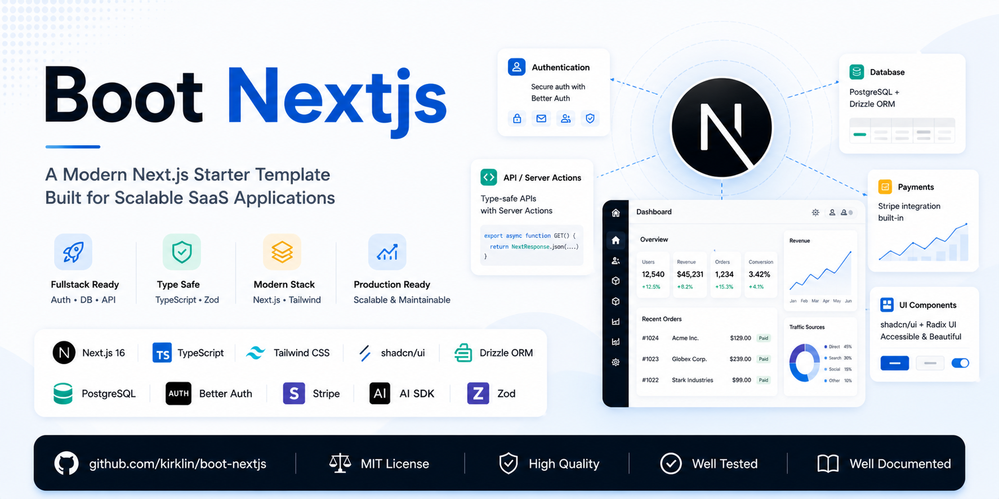

<div align="center">



<br />

**English** | [简体中文](./README.zh-CN.md)

</div>

<br />

# Boot Next.js

A modern Next.js starter template built for ai SaaS applications.

## Features

- **Next.js 16** — App Router, Turbopack, Server Actions, React 19
- **Authentication** — Secure auth with [Better Auth](https://www.better-auth.com/)
- **Payments** — Stripe integration built-in
- **Database** — PostgreSQL + [Drizzle ORM](https://orm.drizzle.team/)
- **AI SDK** — Vercel AI SDK for streaming LLM responses
- **UI Components** — [shadcn/ui](https://ui.shadcn.com/) + Radix UI
- **Internationalization** — [next-intl](https://next-intl.dev/) for multi-language support
- **Type Safe** — End-to-end TypeScript + Zod validation
- **Code Quality** — ESLint with [@kirklin/eslint-config](https://github.com/kirklin/eslint-config)
- **Dark Mode** — next-themes with system preference detection

## Tech Stack

| Category   | Technology              |
| ---------- | ----------------------- |
| Framework  | Next.js 16, React 19    |
| Language   | TypeScript 5.9          |
| Styling    | Tailwind CSS 4          |
| UI         | shadcn/ui, Radix UI     |
| Database   | PostgreSQL, Drizzle ORM |
| Auth       | Better Auth             |
| Payments   | Stripe                  |
| AI         | Vercel AI SDK           |
| Validation | Zod                     |
| i18n       | next-intl               |
| Animation  | Framer Motion           |
| Charts     | Recharts                |

## Getting Started

### Prerequisites

- Node.js >= 18
- pnpm >= 9
- PostgreSQL

### Setup

```bash
git clone https://github.com/kirklin/boot-nextjs.git
cd boot-nextjs
pnpm install
cp .env.example .env
pnpm drizzle-kit push
pnpm dev
```

Open [http://localhost:3000](http://localhost:3000) in your browser.

## Project Structure

```
src/
├── app/             # App Router pages & API routes
│   ├── [locale]/    # i18n dynamic routes
│   └── api/         # API routes
├── components/      # Reusable UI components
├── config/          # Application configuration
├── data/            # Data layer & constants
├── hooks/           # Custom React hooks
├── lib/             # Utility libraries
├── locales/         # i18n translation files
└── styles/          # Global styles
```

## Scripts

| Command         | Description                     |
| --------------- | ------------------------------- |
| `pnpm dev`      | Start dev server with Turbopack |
| `pnpm build`    | Build for production            |
| `pnpm start`    | Start production server         |
| `pnpm lint`     | Run ESLint                      |
| `pnpm lint:fix` | Fix ESLint errors               |
| `pnpm test`     | Run tests with Vitest           |
| `pnpm ui`       | Add shadcn/ui components        |

## Contributing

Contributions are welcome. Please fork the repo, create a feature branch, and submit a PR.

## License

[MIT](./LICENSE) © 2025-PRESENT [Kirk Lin](https://github.com/kirklin)
